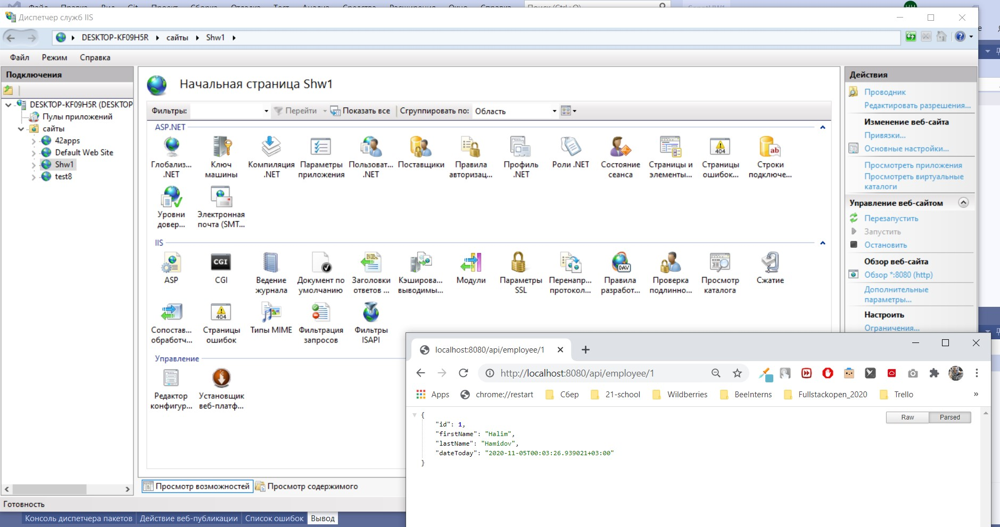

# Часть 1. Настройка и шаблон приложения
## HWPart1

## Чек-лист:

1.	Создать web-api приложение. Проверить его запуск

2.	Перенести в него функциональность тестовых заданий 1 и 2 (создание вопросов, заседание, поиск в БД). Должны быть реализованы контроллеры, которые принимают на вход json-ы по созданию вопросов, заседаний и затем создают их на dev-стенде. 

3.	Перевести приложение на OWIN(добавить Startup, webApi как middleware)

4.	Добавить middleware для логирования всех запросов и ответов

5.	Развернуть приложение на IIS

Дополнительно: при желании можно попробовать развернуть при ложение через средства Visual Studio или через явный вызов утилиты msdeploy



https://localhost:44364/api/employee/1

```
В iis нет обработчиков похоже. Проще всего установить .net core sdk. Установщик все исправит.
```
Но почему-то с этим пакетом выдает ошибку: 
```
Программа "имя выходного файла" имеет несколько заданных точек входа. Выполните компиляцию с параметром /main, чтобы указать тип, который содержит точку входа.
```

и в IIS  HTTP Error 500.19 - Internal Server Error
Error Code	   0x8007000d

The problem with IIS was solved with downloading and installing of 
https://dotnet.microsoft.com/download/dotnet-core/thank-you/runtime-aspnetcore-3.1.9-windows-hosting-bundle-installer

and less likely this
https://www.iis.net/downloads/microsoft/url-rewrite


https://www.youtube.com/watch?v=PPaqVyBkwMk&t=8s&ab_channel=IAmTimCorey
